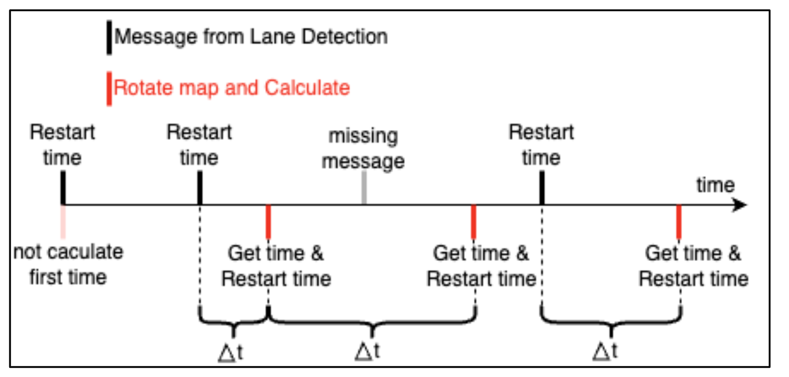
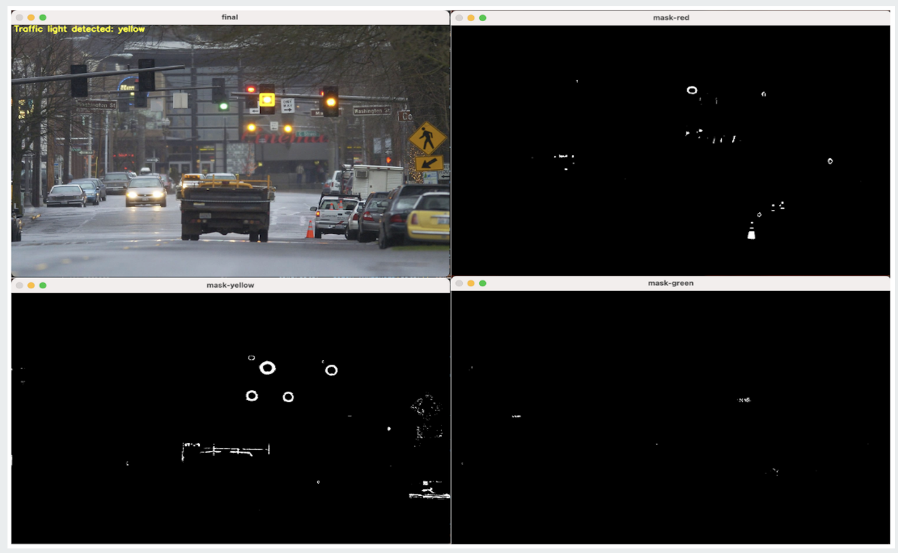
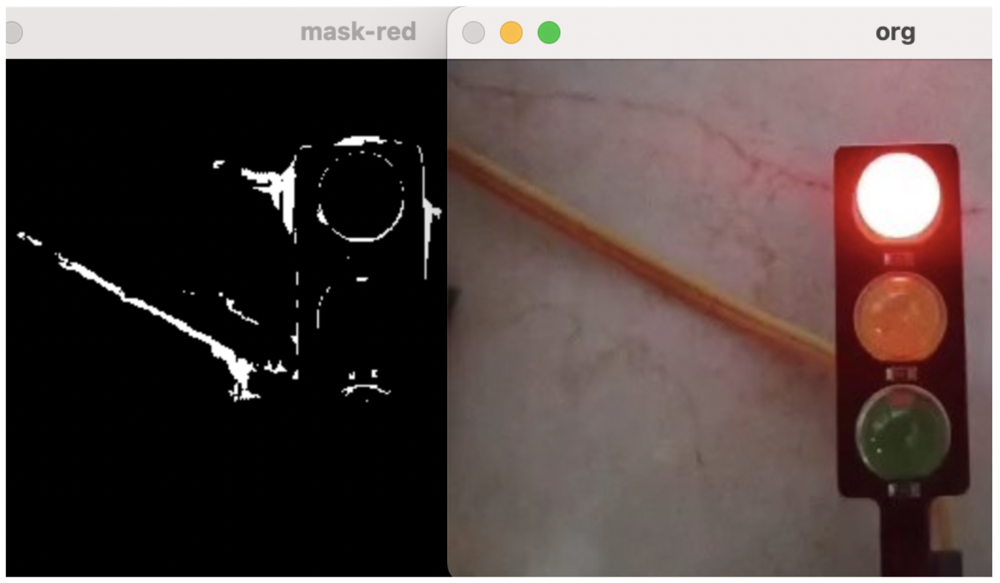
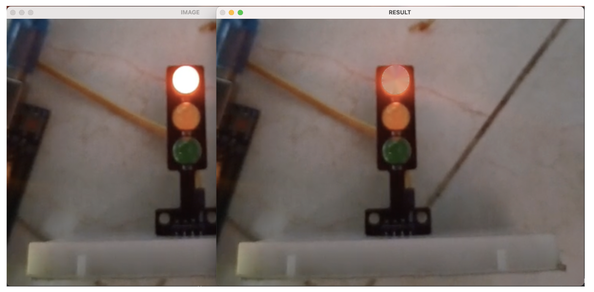

# Autonomous-Car
DEVELOPMENT OF DRIVING-ASSISTED SYSTEM FOR AUTONOMOUS CAR

**Installation:** Open Terminal and do above step

**STEP 1: CREATE WORKSPACE** 
```
cd ~
mkdir NCKH_workspace
cd NCKH_workspace
mkdir KOT3_ws
cd KOT3_ws
mkdir src
```
**STEP 2: CONNECT WITH REMOTE REPO** 
```
cd src
git init 
git remote add origin https://github.com/CEK19/Autonomous-Car.git
git pull origin main
```
**STEP 3: BUILD WORKSPACE**
```
cd ~/NCKH_workspace/KOT3_ws/
catkin_make
```

**STEP 4: RUN PROJECT**

Based on this video, we guide you how to connect Turtlebot3, run the project and try to connect lane detection model: [Video](https://youtu.be/JL_jAX7FTZk).

---
**Source structure**:   
-  **build:** contains script to build workspace ROS
-  **dataset_kitty:** folder contains dataset to train/test
-  **documentation:** contains software documentations & more information
-  **kot3_pkg:** contains script & folder relative to ROS
-  **report:** contains result of testing
-  **src:** contains mains algorithms script (don't have ROS script here)
---
**Contribute Project Rule:**

-**Commit message:** *"#ISSUE_NUMBER date: detail changing of this commit"* => **Example:** *"#4 20-08-2022: changing folder structure for understandable purpose"*

**Authors**:
- Nguyen Trong Nhan - 1914446
- Nguyen Duy Thinh - 1915313
- Le Hoang Minh Tu - 1915812

---
# Guideline:
---

### Module né vật cản

> File deploy robot: [ros_combine_lidar_lane.py](./kot3_pkg/scripts/ros_combine_lidar_lane.py)
> Đường dẫn tới thư mục các hướng tiếp cận quá khứ: ```"src/objectMovementDetection/"```
> Cấu trúc thư mục bao gồm:
> - Reinforcement Learning/: Đây là thư mục chứa việc nghiên cứu về việc áp dụng Reinforcement Learning
> - Algorithm/: Đây là thư mục chứa các nghiên cứu về việc áp dụng giải thuật như D* và A*


- Các cách tiếp cận:
  1. Reinforcement Learning (RL): Với ý tưởng rằng, ta sẽ train robot trong môi trường mô phỏng rất nhiều lần, nhằm giúp robot học được kinh nghiệm. Từ đó đem model nạp xuống robot và chạy thực tế. Tuy nhiên do sự bùng nổ về số state đầu vào. Và thiếu hụt thông tin về vận tốc và hướng của vật cản, nên hướng tiếp cận RL cho ra kết quả không khả quan.
  2. Giải thuật tìm đường đi: Ta có thể áp dụng một số giải thuật tìm đường đi như D*, A*, BFS, DFS, Best First, ... Đối với hướng tiếp cận này, sẽ không thể có thể né các vật cản lao từ đằng sau.
- Hướng tiếp cận đang được sử dụng (cách 2):
  - **Bước 1:** Cài đặt thư viện
  ```
  pip install pathfinding
  ```
  - **Bước 2:** Visualize dữ liệu lên map kích thước 50x50 pixel
    - Theo quy ước về tỉ lệ 1x1 pixel<sup>2</sup> = 2x2 cm<sup>2</sup>
    - Từ quy ước trên, ta có thể visualize dữ liệu từ lidar lên map một cách chính xác theo đúng tỉ lệ.
    - Tuy nhiên việc visual làn đường có tính tương đối hơn, và sẽ được xử lý bên khối AI làn đường.
    - Hàm vẽ map sẽ được xử lý như hàm trigger, nghĩa là nếu có 1 trong những input được update mới, map sẽ được update theo.
    - Trong đó, ta có áp dụng phình vật cản. Với ```độ phình của vật cản = bán kính robot + hằng số``` (hằng số này sẽ giúp robot né một cách an toàn hơn). Bên cạnh đó, làn đường cũng cần được vẽ dày lên với hàm **cv.line( size=2 )**, việc này giúp ngăn ngừa giải thuật kiếm đường đi xuyên qua làn đường (khi làn đường đang nằm nghiên)
  - **Bước 3:** Ta cần chọn điểm goal tạm thời để làm input của giải thuật.
    - Các giải thuật tìm đường cần input gồm vị trí hiện tại và vị trí đích. Chính vì vậy, ta cần tìm ra cơ chế chọn điểm goal phù hợp (đọc thêm tại [mục 4.2.2.3 Cách chọn điểm goal ở từng frame](https://drive.google.com/file/d/1Z_Ez_u44AQI37l7NrvjPNhta7aDiH2m1/view?usp=drive_link)).
  - **Bước 4:** Một số chiến thuật
    - **Tìm khoảng cách từ robot đến goal (đã bỏ):** Cách này khi áp dụng nhận được kết quả không như mong đợi, hành vi của robot khá lắc, lắc trái, lắc phải.
    - **Tìm khoảng cách hình chiếu từ robot lên 2 làn đường:** nhằm tìm làn mà robot gần hơn.
    - **Tìm khoảng trống trước robot:** nhằm giúp robot né từ xa.
    - **Xoá hàng ngang tại điểm goal:** giúp robot tránh bị stuck khi vẫn còn đường di chuyển
  - **Bước 5:** Áp dụng cơ chế xoay map (tăng tính đảm bảo khi không có dữ liệu AI làn đường gửi tới)
    - Cần tính toán thời gian khi bắt đầu xoay map:
    
    - Trong đó, ta sẽ tiến hành xoay map mỗi khi 


---

### Module nhận diện làn đường

Các code bên dưới sẽ được đề cập tính từ thư mục Autonomous-Car\src\lane-detect
Các file không được đề cập có thể được xem như file rác.
Cấu trúc thư mục ảnh chuẩn (sử dụng từ phiên bản demo 5 trở đi) có cấu trúc như sau:

-	Image: tập chứa ảnh
-	image_org hoặc orgimg: tập chứa ảnh gốc, ảnh trong tập image đã qua một bước xử lý (thường là khi loại bỏ các tấm chưa được label trong tập ảnh)
-	output: ảnh segment phần làn đường, các pixel có làn sẽ là 255
-	predic: ảnh visula kết quả, ảnh gốc sẽ là ảnh gray, và vùng làn đường sẽ có màu (thường là hồng – đỏ)

Các tập muốn train cần có ảnh tập image và tập output có cùng số lượng ảnh, nếu không, chỉ có thể sử dụng code từ phiên bản demo5 trở đi (có chức năng tự động skip các ảnh không có label hoặc không có image ). Vấn đề thường gặp khi label chưa hết tập ảnh.

Các ảnh background thường được lấy từ youtube, với các từ khoá “best upcoming movies 2023” để tìm được video đủ dài, các cảnh được chuyển liên tục và nhiều đường nét / hoạ tiết.

- Luồng xử lý (Quá trình Train)
  - Sinh model và hàm loss: kiến trúc model được lấy tại https://github.com/zhixuhao/unet, tham số hyperparameter của hàm loss tuỳ vào từng file train khác nhau
  - Data Augmentation: Bao gồm các hành vi thay đổi độ sáng, nhiễu, ép, flip. ở file train phiên bản 7, quá trình augment được thực hiện một lần duy nhất, tuy nhiên đối với một số file train khác, quá trình augment sẽ được thực hiện lại sau một số epoch nhất định
  - Train: Ảnh đầu vào ở ảnh label có hai giá trị là 0-1 thay vì 0-255, do đó các giá trị cần chia 255 để quá trình train diễn ra hiệU quả. Việc lưu ảnh label là 0-255 giúp ta dễ đối chiếu ảnh label so với ảnh đầu vào.
  - Validation và lưu model: chỉ có file train phiên bản 7 có quá trình tách data cho validation. Các phiên bản mới hơn chỉ lưu model một lần sau khi train xong, nhưng các phiên bản cũ sẽ lưu model sau một số lần train.

- Luồng xử lý (Quá trình Test)
  - nạp model: model là file .hdf5 được lưu trong quá trình train, tuy nhiên file này không kèm định nghĩa của hàm loss, do đó hàm loss cần được khai báo trước và chỉ định lại trong quá trình nạp model
  - xử lý output: với các phiên bản test cũ hơn, có thể có nhiều dạng output đƯợc sinh ra trong các file tương ứng, dạng label (dữ liệu thô của predic), dạng overlay (các vùng làn đường sẽ được tô màu với độ đậm 50% hoặc 100%, trong khi ảnh gốc sẽ là ảnh xám)
  - một số xử lý khác: có một số file test đọc từ video, do đó hàm sẽ lặp qua toàn bộ videl có trong folder và ghép thành một video output dạng overlay duy nhất. Một số video có tên đặc thù sẽ có những quá trình tiền xử lý khác nhau.

**AI làn đường (thư mục src)**

-	*demo_third_train*: file huấn luyện sử dụng model unet, từ phiên bản demo thứ 3 trở đi, cấu trúc cố định bao gồm khai báo model Unet, khai báo hàm loss. Các bạn không cần kiểm tra lại. bản demo số 3  huấn luyện ảnh segmentation với data có sẵn, chỉ argument lật ảnh theo 4 hướng.
-	*demo_third_test*: file test kết quả output từ model AI, những vùng segmen sẽ được tô màu tím với cường độ 50% lên bức ảnh gray.
-	*demo_four_train*: kế thừa từ demo 3, tuy nhiên, các ảnh train sẽ được argument ngẫu nhiên mỗi khi chạy huấn luyện bằng bộ số input bởi hàm randomImage. Bộ số được áp dụng chung cho bộ ảnh input và label, vì argument có các hành vi xoay, scale và flip.
-	*demo_four_test*: Kế thừa từ demo3, phiên bản này hỗ trợ chạy test trên video hoặc folder nhiều video, kết quả trả về có thể là nhiều video, một video hoặc tập ảnh.
-	*demo_five_train*: Kế thừa từ demo 4, phương pháp argument được cải tiến bao gồm tăng giảm cường độ ánh sáng, chệch màu, blur, nhiễu hạt tiêu, xoá một rectangle ngẫu nhiên. Ngoài ra, phiên bản này cũng hỗ trợ kiểm soát đầu vào ảnh, bao gồm việc lấy ra n ảnh từ tập dataset, tập dataset bao gồm các ảnh trong tư mục ảnh chuẩn và tập ảnh background, các bức ảnh sẽ được argument và chạy huấn luyện, sau mỗi epoch, GPU sẽ được nghỉ 20s.
-	*demo_five_test*: tương tự demo 3, tuy nhiên, kết quả predic có thể chạy tương thích với cấu trúc thư mục ảnh chuẩn, bao gồm outpput kết quả visual và kết quả ở dạng predic, kết quả đó có thể được dùng như label để huấn luyện lại model.
-	*demo_six_train*: thử nghiệm phương pháp chỉ argument data một lần duy nhất, và huấn luyện với lượng ảnh và epoch lớn
-	*demo_seven_train*: kế thừa từ demo train 6, tuỳ chọn được tỉ lệ giữa ảnh làn đường và ảnh background, ảnh làn đường giờ sẽ vẽ ngẫu nhiên các đường nét random và một số cải tiến khác về argument. Có split ảnh để chạy tập validation, dùng để vẽ đồ thị báo cáo. Kết quả lịch sử sẽ ghi lại vào file json và vẽ sau.
-	*gazebo_train*: kế thừa từ demo train 3, vì chỉ train ở gazebo nên quá trình sẽ rút gọn và đơn giản hơn
-	*interpolation*: khai báo các hàm hỗ trợ quá trình trong việc tìm kiếm argument tối ưu, sử dụng code auto train, nhưng mỗi lần chạy ta sử dụng model mới, hai parameter của hàm loss sẽ dựa trên hàm này, hàm này sử dụng lịch sử của các parameter và kết quả huấn luyện để tính toán bộ parameter tối ưu nhất cho lần huấn luyện kế tiếp.
-	*log.txt*: kết quả quá trình tìm kiếm argument, giá tri 4 số lần lượt là alpha, gamma, độ chính xác train, độ chính xác test
-	*try7*: vẽ đồ thị
-	*auto_train.py*: là file huấn luyện kế thừa từ train_5, Mình sẽ viết một app C# WPF để tự động gọi file python này, vì mình cần thử nghiệm việc argument data mới mỗi 5 epoch. Tuy nhiên, nếu argument quá nhiều sẽ gây ra tràn Vram của GPU. Do đó khi sử dụng một ứng  dụng C# để tạo và xoá một process python, Vram sẽ được làm sạch và không gây ra crash hệ thống.

**Các file hỗ trợ việc label làn đường (thư mục dataset_process)**

Video giải thích và hướng dẫn từng file ở [video này](https://youtu.be/4btCJ3rfGkg)

**Các file hỗ trợ việc label làn đường (thư mục dataset_process)**

- *modelTCP_server*: file server chính thức, là file chạy ở thiết bị window để nhận dữ liệu từ tcp và trả kết quả, quá trình bao gồm mở port, đợi tín hiệu từ model, chạy backend, song song hoá, tái tạo làn đường, warp, trả kết quả.

- *modelTCP_server_tryFaster*: server phiên bản không output các thông tin log và không show ảnh debug

- *modelTCP_server_debug*: server phiên bản nhận ảnh từ máy thay vì tcp, dùng để debug các lỗi ở file *modelTCP_server* nhanh hơn vì không cần chạy ROS/máy ảo

- *LaneDetect_model*: file chạy model và backend, phiên bản backend số 1 (được phát triển bởi Trọng Nhân)

- *LaneDetect_model_v2*: file chạy model và backend, phiên bản backend số 2 (được phát triển bởi Duy Thịnh và Trọng Nhân), được sử dụng trong quá trình demo. Backend này tách các vùng phát hiện và sử dụng bộ lọc dựa theo kích thước để phân biệt vùng trái, vùng phải và vùng lỗi.

- *LaneDetect_model_visual*: tương tự *LaneDetect_model*
 với một số visual về kết quả để phục vụ debug

**Data và model ví dụ**
Data được đặt ở [link này](https://drive.google.com/drive/folders/1GaTe5gqs6ncXDwlXcU8HhgwpxmdThIxt?usp=sharing)

- *labeled_v8*: Bao gồm một số ảnh và label sẵn

- *Model-CARLA9_epoch2*: Model tổng quát, được sử dụng trong nhiều môi trường khác nhau

- *Model-S5_AUTO-13*: Model được huấn luyện overfit với môi trường demo

---

### Module nhận diện và phân loại biển báo giao thông

- Các cách tiếp cận: Có 2 cách tiếp cận chính gồm:
  - [1] OpenCV + CNN: Sử dụng các kĩ thuật Computer Vision để định ra vị trí sau đó cắt biển báo tại vùng boundary box đó để đưa vào CNN. Tuy nhiên thì do là thuật toán thị giác máy tính nên rất dễ bị ảnh hưởng bởi ánh sáng và không xử lí được nhiều trường hợp khác nhau.
  - [2] YOLOV8 + CNN: YOLOV8 được sử dụng trong việc Object Detection, tức là chỉ định ra vị trí của các biển báo trên hình và đóng khung chúng lại. Sau đó 
- Hướng tiếp cận đang được sử dụng: Cách [2] YOLOV8 + CNN. Chi tiết sẽ được mô tả bên dưới.

**Bước 1: [YOLOV8] Cài đặt thư viện**: 
```
pip install ultralytics
```

**Bước 2: [YOLOV8] Lựa chọn mô hình phù hợp:** 

Ở đây hiện đang có 4 loại Detection, Segmentation, Classification, Pose. Nhưng mục đích chính của YOLOV8 được sử dụng trong bài toán này là xác định được vị trí của biển báo nên ta sẽ sử dụng _YOLOV8n.pt_ để optimize thời gian xử lí. Vì ở bước này chưa cần độ chính xác quá cao.

**Bước 3: [YOLOV8] Chụp hình thực tế để thu thập dữ liệu**

**Bước 4: [YOLOV8] Gán nhãn dữ liệu:**

Truy cập https://www.makesense.ai/ > Đánh nhãn > Xuất ở định dạng YOLO XML > Download

**Bước 5: [YOLOV8] Huấn luyện mô hình:**

Tổng quan các bước gồm: Config file > Huấn luyện > Lưu model dưới định dạng "anyNameModel.pt"

**1. Tạo folder train và validation:**
   - Train:
     - /PATH_TO_TRAIN/train/images (trong đây chưa các ảnh train *.jpg)
     - /PATH_TO_TRAIN/train/labels (trong đây chưa các file train labels *.txt)
   - Validation:
     - /PATH_TO_VAL/val/images (trong đây chưa các ảnh validation *.jpg)
     - /PATH_TO_VAL/val/labels (trong đây chưa các file validation labels *.txt)
**2. Chỉnh sửa file configuration:**

```config.yaml
train: /PATH_TO_TRAIN/train/images
val: /PATH_TO_VALIDATION/val/images
names: 
  0: sign
  // 1: another_thing1 (if need) -> new label
  // 2: another_thing (if need) -> new label 
```
**3. Huấn luyện: Tham khảo file sau main.ipynb:**
[Reference Training Folder](https://drive.google.com/drive/folders/1odlIC2L1V09jNq_5MxbbNF4dSDWKU7GN?usp=sharing)

**4. Save và tải model:**

Tạm gọi mô hình đã được huấn luyện có tên là signal.pt

Tới bước này ta đã xong bước huấn luyện YOLO, ta sẽ triển khai YOLO để cắt được phần ảnh hợp lí nhất sau đó đưa vào CNN. Giả sử đã cắt được bước hình biển báo giao thông rồi và bây giờ cần phân loại, ta tiếp tục các bước sau đối với CNN

**Bước 6: [CNN] Lựa chọn model và data phù hợp:**

Tham khảo model + data biển báo giao thông được lấy tại [đây](https://www.kaggle.com/datasets/valentynsichkar/traffic-signs-preprocessed) của tác giả này.

**Bước 7: [CNN] Data augmentation:**

Dựa vào data đã thu thập được, sau đó ta thu thập thêm data thực tế của mình và gán nhãn. Sau đó thực hiện một số kĩ thuật data augmentation tại [đây](https://www.tensorflow.org/tutorials/images/data_augmentation). Có thể ghép thêm nền của các vật cảnh khác từ nhữg hình có sẵn để tăng độ chính xác và tổng quan của model

**Bước 8: [CNN] Huấn luyện model CNN:**

Tham khảo tại file sau: [đây](https://github.com/CEK19/Autonomous-Car/blob/document/src/trafficSignDetection/train.ipynb)

**[Tổng kết]**: Toàn bộ quá trình từ việc triển khai model signal.pt để cắt hình hợp lí nhất, sau đó đưa vào CNN có thể tham khảo tại: [Ref YOLO + CNN](https://github.com/CEK19/Autonomous-Car/blob/document/kot3_pkg/scripts/trafficSignV2.py). Về ý tưởng chung được miêu tả như sau:
- Sử dụng YOLO để cắt hình biển báo ra khỏi hình tổng. Trên một hình có thể có nhiều biển báo và ta ưu tiên vị trí boundary box có độ chính xác lớn nhất mà thoả ngưỡng về kích cỡ.
- Hình biển báo sau khi được crop ra sẽ được đưa vào khối CNN để phân loại 1 trong 5 loại biển báo đã đề ra.
- Lưu ý rằng nên thay đổi kiến trúc model CNN để được độ chính xác cao hơn.

---

### Module nhận diện và phân loại đèn giao thông [Phần này chưa được sử dụng trong hệ thống thực]

> Đường dẫn tới thư mục: ```"src/trafficLightDetection/"```
> Cấu trúc thư mục bao gồm:
> - research/: Đây là thư mục chứa các code thử nghiệm một số cách khác (tăng / giảm độ sáng)
> - assets/: Đây là nơi lưu trữ những tấm ảnh đèn giao thông
>   - assets/choaLedResult/: Đây là folder chứa kết quả sau khi xử lý choá
> - [const.py](./src/trafficLightDetection/const.py): chứa các hằng số, và các thông số config
> - [main.py](./src/trafficLightDetection/main.py): giải thuật để phân loại đèn giao thông. Gồm 3 mode là
>   - pic: đọc 1 bức ảnh và đưa ra tín hiệu đèn
>   - camera: đọc liên tục từ dữ liệu camera / webcam
>   - video: đọc từng frame của video và trả kết quả liên tục
> - [choaLedHandler.py](./src/trafficLightDetection/choaLedHandler.py): Xử lý choá sáng cho đèn

- Các cách tiếp cận: 
  1. **Computer Vision:** Bằng việc lọc các khoảng màu xanh / đỏ / vàng, và tìm vùng màu có kích thước hình tròn và giới hạn trong 1 độ lớn, ta có thể xác định được màu của đèn giao thông trong môi trường phòng thí nghiệm.
  2. **YOLO V8:** xử dụng yolo v8 để tìm và phân loại đèn giao thông.
  
- Hạn chế:
  - **Độ choá cao:** Do module đèn của arduino có cấu tạo khá bự, dẫn đến độ choá cao (đã xử lý được trường hợp này)
  - **Độ phân giải thấp:** Do hạn chế về độ phân giải của camera robot (chưa thể cải thiện, có thể được cải thiện khi nâng cấp camera mới)

- Hướng tiếp cận đang được sử dụng (hướng 1):
  - **Bước 1:** Ta tiến hành lọc màu đỏ / xanh / vàng trong bức hình
    - Ta cần xác định khoảng màu và kẹp lại bằng **cv2.inRange(lowerColor, upperColor)**, hàm này với đầu vào là màu HSV. Chính vì vậy, ta cần tool để xác định khoảng màu phù hợp. Tool tìm khoảng màu HSV có thể được tìm thấy trong thư mục ```src/trafficLightDetection/HSV_Picker```. Và thực hiện theo file [/HSV_Picker/README.md](./src/trafficLightDetection/HSV_Picker/README.md) trong thư mục đó.
    - Đầu ra của bước này là 3 tấm ảnh, với mỗi tấm ảnh giữ lại 1 màu lần lượt là xanh / đỏ / vàng.
  - **Bước 2:** Tìm vùng khoảng màu phù hợp
    - Ta dựa vào **cv2.findContour** để tìm vùng khoảng màu có kích thước kẹp trong khoảng min-max và có khung chứa là hình gần vuông (do ánh sáng mờ mờ từ đèn có thể bị bắt trong quá trình này).
    - Vùng mà ta thu được từ quá trình trên chính là vùng chứa đèn giao thông.
  - **Bước 3:** Ta chọn màu có vùng lớn nhất
    - Trong trường hợp ta có thể thấy được nhiều ngã 4 trong cùng 1 thời điểm
    
    Khi này ta sẽ lấy đèn gần ta nhất (kích thước vùng màu lớn nhất)
  - **Bước 4:** Xử lý choá (phiên bản camera điện thoại)
    - Sau khi đã giữ lại khoảng màu đỏ mong muốn, tuy nhiên do hiện tượng choá, nên phần trung tâm của đèn ta không bắt được, và phần vièn có thể mỏng. Xe sẽ khó nhận diện khi nhìn đèn với 1 góc xiên.
    
    - Khi này, nhằm giải quyết vấn đề trên, ta tìm các khoảng gần màu trắng tuyệt đối (trắng do loá sáng gây ra), sau đó áp dụng hàm **cv2.inpaint()** để tô phần màu trắng bằng 4 pixel xung quanh. Kết quả thu được như hình bên dưới
    
