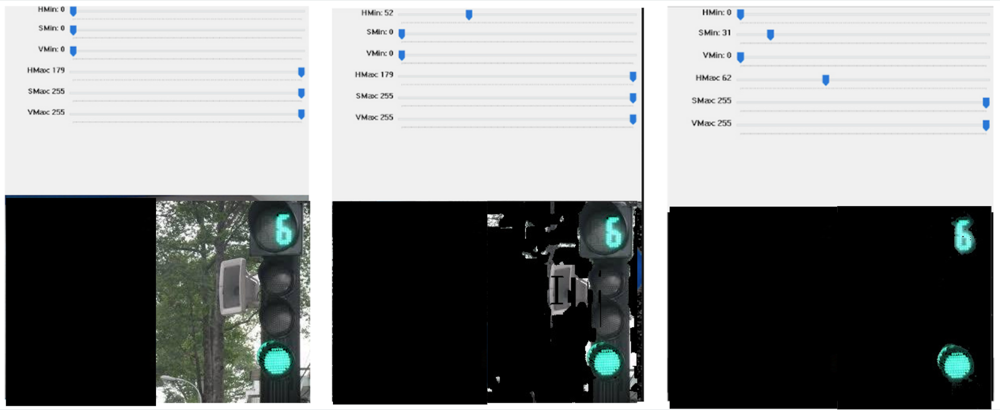

# Tool để kiếm khoảng màu HSV

## Các file trong thư mục

Ta có thể chọn trong các file bên dưới, có một số file sẽ ko tương thích với một số dòng laptop (Vd: không tương thích với macbook M2, nhưng MSI vẫn mở được)

## Nguồn gốc các file

Các file trên là thu thập từ các nguồn internet như github / stackoverflow / ...

## Các bước

1. Chuẩn bị:
   - Ta sẽ chuẩn bị ảnh có màu sắc cần giữ lại (vd: ảnh có chứa đèn giao thông)
   - Ta sẽ import và tiến tới bước 2
1. Kéo thả các thanh
   - Ta sẽ tiến hành kéo thả các thanh, sao cho kẹp được khoảng màu mong muốn (như hình dưới)
   